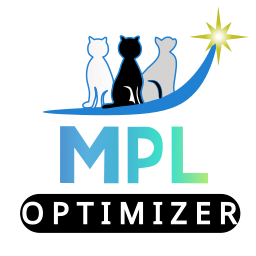

# MPL Optimizer
<p align="center">
  
</p>

<h1 align="center">MPL Optimizer</h1>

<p align="center">
  Modular Process Learning Optimizer
</p>
**MPL (Modular Process Learning Optimizer)** is a Windows desktop application for process simulation and optimization.

MPL provides a graphical interface for defining decision variables, objective functions, constraints, optimization algorithms, and algorithm hyperparameters. It can communicate with Aspen Plus simulations and use Python-based optimization algorithms to evaluate and optimize process models.

## Main Features

- Windows desktop interface developed with C# and WPF.
- Connection with Aspen Plus through COM automation.
- Automatic reading of simulation variables from the Aspen model tree.
- Selection of input and output variables directly from the graphical interface.
- Continuous and discrete decision variables.
- Definition of lower and upper bounds.
- Single-objective and multi-objective optimization.
- Definition of mathematical constraints.
- Integration with Python optimization routines.
- Export and storage of optimization results.
- Support for evolutionary and Bayesian optimization methods.

## Optimization Algorithms

MPL includes or is being developed to support several optimization approaches, including:

### Single-objective optimization

- Genetic Algorithm (GA)
- Differential Evolution (DE)
- Particle Swarm Optimization (PSO)
- CMA-ES
- Nelder-Mead
- Pattern Search
- Bayesian Optimization
- Trust-Region Bayesian Optimization
- Mixed-variable Bayesian optimization methods

### Multi-objective optimization

- NSGA-II
- NSGA-III
- R-NSGA-II / R-NSGA-III
- MOEA/D
- SMS-EMOA
- RVEA
- Multi-objective Bayesian Optimization
- Mixed-variable Bayesian optimization methods

The available algorithms may change as development continues.

## System Requirements

### To run MPL

- Windows 10 or Windows 11 (64-bit)

A packaged release of MPL is intended to include the required .NET components and Python optimization environment whenever possible.

### Aspen Plus integration

Aspen Plus is required only when using Aspen-based simulation and optimization features.

The target computer must have:

- Aspen Plus installed
- A valid Aspen Plus license
- Aspen COM automation correctly registered in Windows

Aspen Plus is **not distributed with MPL**.

## Installation

### Recommended method

Download the latest MPL installer from the **Releases** section of this GitHub repository.

1. Download `MPL_Setup_x.x.x.exe`.
2. Run the installer.
3. Follow the installation wizard.
4. Start MPL from the Start menu or desktop shortcut.

> The installer will be added to GitHub Releases as packaged versions of MPL become available.

## Building from Source

If you want to modify MPL or build the application yourself:

1. Clone this repository.
2. Open the solution in Visual Studio.
3. Restore the required NuGet packages.
4. Build the solution in `Release` mode.
5. Make sure the Python optimization components are available.
6. If Aspen-based functionality is required, make sure Aspen Plus is installed and licensed.

## Python Optimization Engine

MPL uses Python for several optimization algorithms and numerical routines.

The Python component contains the optimization runner and algorithm implementations used by the WPF application.

Depending on the build/distribution method, Python and its dependencies may either be packaged with MPL or configured separately for development.

Typical Python dependencies include packages for:

- Numerical computing
- Data processing
- Evolutionary optimization
- Bayesian optimization
- Aspen COM communication

## Application Architecture

```text
MPL
├── WPF User Interface
│   ├── Variable selection
│   ├── Objectives
│   ├── Constraints
│   └── Algorithm configuration
│
├── Aspen Interface
│   ├── Simulation loading
│   ├── Aspen Tree access
│   ├── Variable read/write
│   └── Simulation execution
│
└── Python Optimization Engine
    ├── Optimization runner
    ├── Evolutionary algorithms
    ├── Bayesian optimization
    └── Results processing
```

## Typical Workflow

1. Open an Aspen Plus simulation.
2. Select process variables from the Aspen tree.
3. Define optimization variables and their bounds.
4. Select simulation outputs.
5. Define one or more objective functions.
6. Add constraints if required.
7. Select an optimization algorithm.
8. Configure the algorithm hyperparameters.
9. Run the optimization.
10. Review and export the results.

## Project Status

MPL is currently under active development.

New optimization algorithms, user-interface improvements, validation tools, and deployment capabilities are being incorporated progressively.

## Disclaimer

MPL is an independent software project. Aspen Plus is proprietary software and is not included with this repository or with MPL distributions. Users are responsible for obtaining and maintaining the appropriate Aspen Plus installation and license when using Aspen-related functionality.
